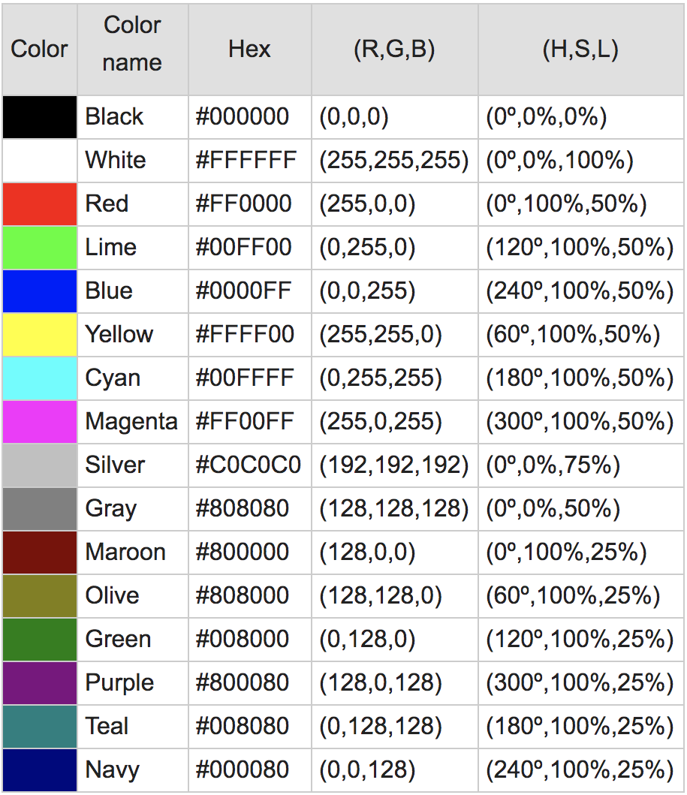

```{r setup, include=FALSE}
knitr::opts_chunk$set(echo = TRUE)
library('tidyverse')
library('dplyr')
```

## Business Case

There are two scenarios that predicting an album genre by it's cover image attributes and title would be usefule

**Scenario A: The Music Label**

In the music industry, it is not unusual for labels to expect that a newly signed artist/band to have their all their branding ready to go for relase at contract signing. This includes the music being mixed and mastered, along with cover art  for their first release on that label. 

**Scenario B: The Music Artist Looking to Get Signed on a Label**

It would be useful for the artist to have a tool that would give them an idea of how much "like" their album cover communicates the genre of their music before they shop lables. For labels, to release their artists' sophomore (and later) albums, it would be a handy tool to input the album cover to get an idea of how much it represents the genre by album cover attributes.

## Data Gathering
Some useful attributes of albums to predict genre would be the `title`, how many `faces` are on the cover, the most prevelant `colors`, identification of various `objects` and how abtract the cover image is - i.e. is it an `illustration` or a `photograph`. Thus the data set `albumData` below:

To gather these variables, I scraped several sources using a custom Node.js API that saved raw data responses into a MongoDB for gathering into well-formatted CSV as follows:

* *Artist Names* come from my personal music collection and is based on the folder names on my NAS' shared **Music** folder.
* For each artist name, a text search was performed via the Disccogs.com search API: `https://api.discogs.com/database/search?artist=<folder-name>`. This yielded up to the first 50 albums in an artist discography, that each contained: `year`, `title`, `genre`, `format`, and the all important `cover_image` url.  
* Once all the album information from my artist collection was scraped, three Google Vision APIs were used to find how many faces, what color content, if there were any musical objects, and whether or not the cover is an abstract illustration or photograph.

Additional criteria for scraping artist albums were that they must be:

* The initial studio release (no singles, EPs, Live/Tour, Greatest Hits/Best of, Soundtracks, Remixes, Remasters, etc.)
* A CD or LP (to avoid duplicate entries from Tapes, file donwloads, etc.)
* Released in the United States (to avoid duplicate entries)

The following three sections describe how image attributes were aggregated from the Google Vision API image search results gather more variables for the album image covers:

### Faces
The `faceDetection` function of Google Vision returns an object for each face found in an image, where those faces are (via coordinates for the eyebrows, eyes, and nose), and the probability of the emotion detected. Many album covers contain portraits of either a solo artist, the entiere band, or a human model. While being able to differentiate what kind of portraits/human subjects are in the photo would be useful, the album data only includes the number of faces detected in the image, for the sake of simplifing the use of `faces` as a predictor in `albumData`. 

### Colors
The `imageProperties` function of Google Vision returns an object that provides a percentage of each color found in the image. Each color is also scored as a percentage of the amount found in the image, and this is the value that is used to determined the most recurrent colors found in an album cover. 

The data Colors returned by `imageProperties` are RGB values, and coverted to six-digit Hexidecimal via the custom Node.js API. However, 16 Million colors can be represented with the RGB and Hexidecimal values. It made more sense to convert this to a more managable list of factored values by converting the numerical color values into Color Names - i.e. from #FF0000 to "Red."

I found the `coloraze` npm module, which converts a Hexidecimal value to the closest color in it's pallette of 2196 color names. While this library is a massive reduction from the 16 Million colors that can be represented in Hex, I reduced the palete further to *16 web-safe colors* (See Figure 1: 16-Color Palette.) This was effective in distilling the essence of an album image's colors into a simplified color scheme and coverted the color values into factored predictors in `albumData` which should be enough to capture variance in album colors for the size of the data set available.

The *3 colors with the highest scores* are saved in `albumData` as: `primary_color`, `secondary_color`, and `tertiary_color`. Their scores are also saved in the similarly named: `primary_score`, `secondary_score`, and `tertiary_score` for the potential of building interactive terms in linear and logistical models if need be.


#### Figure 1: 16-Color Palette:
The list of colors used to reduce the range of 6-digit Hexidecimal colors from 16 Million continous values to 16 unique factors.

{width=50%}

### Captions

TBD - `labelDetection`

## EDA
With the data scraping and aggregation completed, let's look at the raw data collected:
```{r, message = FALSE}
albumCovers <- read_csv('data/album-cover-data.csv')

glimpse(albumCovers)
```

```{r}
colSums(is.na(albumCovers))
clean_dat <- albumCovers %>%
  drop_na()
glimpse(clean_dat)
colSums(is.na(clean_dat))
```

There are only 31 artists with missing album `years` as well as 1 record that didn't have a 3rd color. I've elected to remove these rows of data as year will not be a factor in determining genre from the album image, which leaves the last observation with a missing 3rd color as insignificant.

```{r}
clean_dat %>% nrow()

clean_dat %>%
  group_by(artist) %>%
  count() %>%
  nrow()

clean_dat %>%
  group_by(artist) %>%
  count() %>%
  ungroup() %>%
  summarize(
    avg_release = mean(n)
  )


```
After **NA's** are removed, there are `833` ablums from `251` artists, with an appromixate average of `3` releases each. Let's take a look and see how this collection of artists is distributed across years, and genres.

```{r}
clean_dat %>%
  ggplot() +
  geom_bar(aes(x=genre)) +
  coord_flip()
```


```{r}
clean_dat %>%
  ggplot() +
  geom_bar(aes(x=year))
```


In the raw data, there are 865 albums

## Machine Learning

Supervised learning is an excellent canditate for training a machine on album attributes, as we already know the `genre`, we'll train a machine with linear and logistical regressions to see which is most effective in predicting the genre of an album. Interactive terms will also be used to emphasize the color related data variables to tease out more variance.

## Analysis


